# 🏦 Credit Risk Default Prediction

<p align="center">
  
  
  
</p>

> **A comprehensive machine learning solution for predicting loan default probability using borrower financial profiles and credit history data.**

This project implements an end-to-end credit risk modeling pipeline that helps financial institutions assess the likelihood of loan defaults. It features multiple classification models, extensive feature engineering, model explainability via SHAP analysis, and comprehensive visualizations.

---

## 📋 Table of Contents

- [Executive Summary](#-executive-summary)
- [Business Problem](#-business-problem)
- [Dataset Description](#-dataset-description)
- [Exploratory Data Analysis](#-exploratory-data-analysis)
- [Feature Engineering](#-feature-engineering)
- [Methodology](#-methodology)
- [Model Performance](#-model-performance)
- [Model Interpretability](#-model-interpretability)
- [Project Structure](#-project-structure)
- [Installation & Usage](#-installation--usage)
- [Results & Conclusions](#-results--conclusions)
- [Future Improvements](#-future-improvements)

---

## 📊 Executive Summary

This project develops machine learning models to predict credit default risk using a LendingClub-style dataset. The key findings are:

| Metric | Best Model | Score |
|--------|------------|-------|
| **ROC AUC** | Logistic Regression | **0.756** |
| **F1 Score** | Random Forest | **0.730** |
| **Precision** | Logistic Regression | **0.755** |
| **Recall** | Random Forest | **0.719** |

**Key Insights:**
- 📈 FICO score is the strongest predictor of default risk
- 💰 Debt-to-Income (DTI) ratio shows strong positive correlation with defaults
- 🏠 Home ownership status has minimal impact on default probability
- 📉 Delinquency history significantly increases default likelihood

---

## 💼 Business Problem

### Context
Financial institutions face significant losses from loan defaults. Accurate prediction of default probability enables:
- **Risk-based pricing**: Adjust interest rates based on predicted risk
- **Portfolio management**: Optimize loan portfolio composition
- **Regulatory compliance**: Meet Basel III/IV capital requirements
- **Loss prevention**: Identify high-risk applications early

### Objective
Build a robust classification model that:
1. Accurately predicts the probability of loan default
2. Provides interpretable results for credit analysts
3. Identifies key risk factors driving default behavior
4. Maintains fairness across different borrower segments

---

## 📁 Dataset Description

### Overview
The dataset simulates LendingClub loan data with 50,000 loan records containing borrower financial profiles and loan characteristics.

### Features

| Feature | Type | Description |
|---------|------|-------------|
| `loan_amnt` | Numeric | Loan amount requested ($1,000 - $40,000) |
| `annual_inc` | Numeric | Annual income of borrower |
| `dti` | Numeric | Debt-to-Income ratio (0-40%) |
| `fico_range_low` | Numeric | Lower bound of FICO score range (620-850) |
| `delinq_2yrs` | Numeric | Number of delinquencies in past 2 years |
| `open_acc` | Numeric | Number of open credit lines |
| `pub_rec` | Numeric | Number of derogatory public records |
| `revol_bal` | Numeric | Revolving balance |
| `revol_util` | Numeric | Revolving utilization rate (0-100%) |
| `total_acc` | Numeric | Total number of credit accounts |
| `mort_acc` | Numeric | Number of mortgage accounts |
| `pub_rec_bankruptcies` | Numeric | Number of public record bankruptcies |
| `emp_length_years` | Numeric | Employment length in years |
| `home_ownership` | Categorical | RENT, MORTGAGE, OWN, OTHER |
| `purpose` | Categorical | Loan purpose (debt_consolidation, credit_card, etc.) |
| `application_type` | Categorical | Individual or Joint application |
| **`default`** | **Binary** | **Target: 1 = Default, 0 = No Default** |

---

## 🔍 Exploratory Data Analysis

### Target Distribution

The dataset exhibits moderate class imbalance with approximately 58% defaults and 42% non-defaults.

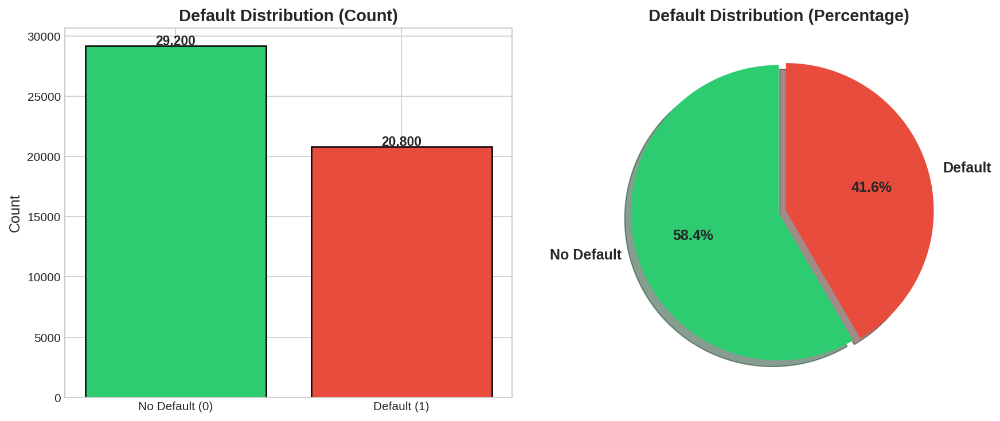

### Feature Correlations

The correlation heatmap reveals important relationships between features:

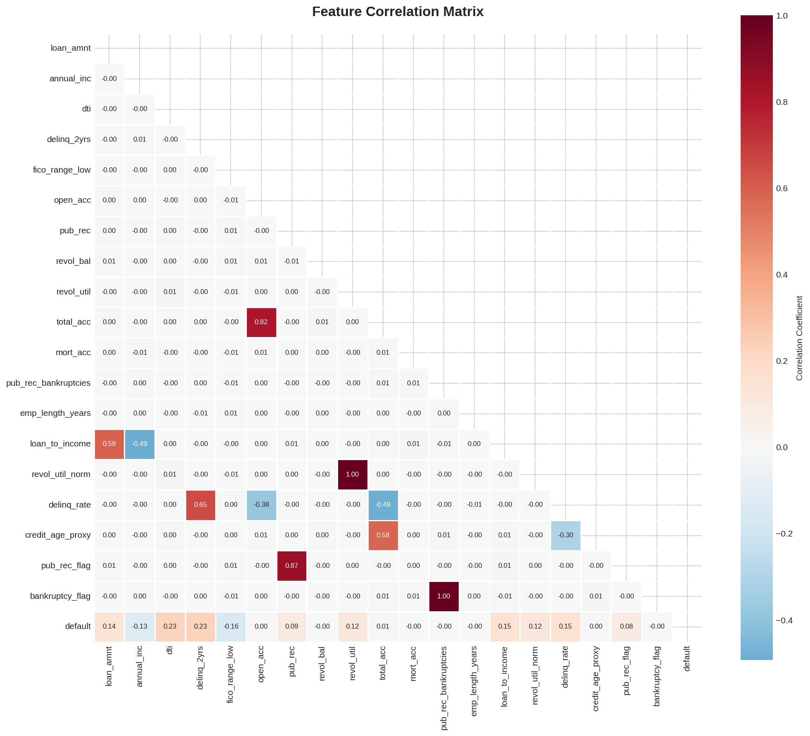

**Key Observations:**
- `delinq_2yrs` shows positive correlation (0.23) with default
- `fico_range_low` shows negative correlation (-0.16) with default — higher scores = lower risk
- `dti` shows positive correlation (0.23) with default — higher debt burden = higher risk
- `loan_to_income` (engineered) shows moderate correlation (0.15) with default

### Default Rate Analysis by Feature Categories

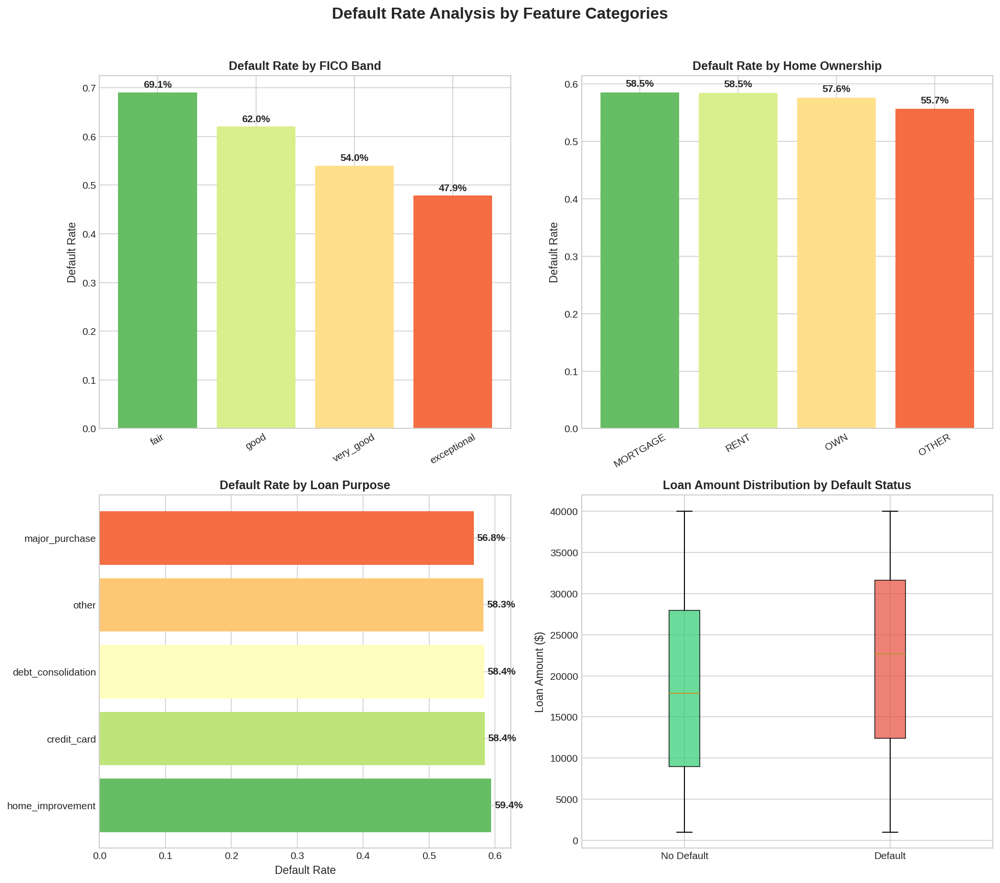

**Insights:**
- **FICO Score**: Clear inverse relationship — "fair" credit (69.1% default rate) vs "exceptional" (47.9%)
- **Home Ownership**: Minimal variation across categories (~56-59%)
- **Loan Purpose**: Home improvement loans show highest default rates (59.4%)
- **Loan Amount**: Defaulters tend to have higher loan amounts

### Feature Distributions by Default Status

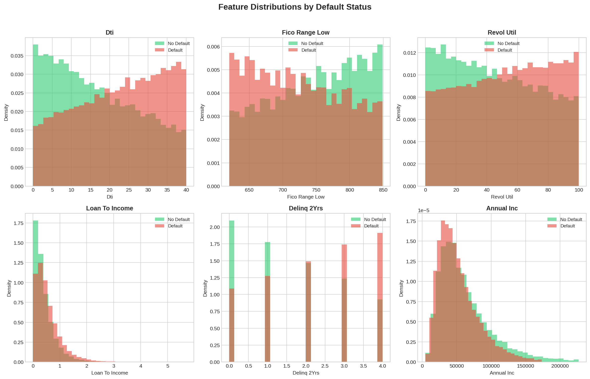

---

## ⚙️ Feature Engineering

Six new features were engineered to capture additional predictive signals:

| Feature | Formula | Rationale |
|---------|---------|-----------|
| `loan_to_income` | `loan_amnt / (annual_inc + 1)` | Measures loan burden relative to income |
| `revol_util_norm` | `revol_util / 100` | Normalized utilization for model stability |
| `delinq_rate` | `delinq_2yrs / (total_acc + 1)` | Delinquency rate per account |
| `credit_age_proxy` | `total_acc - open_acc` | Proxy for credit history length |
| `pub_rec_flag` | `1 if pub_rec > 0 else 0` | Binary indicator for any public records |
| `bankruptcy_flag` | `1 if pub_rec_bankruptcies > 0 else 0` | Binary bankruptcy indicator |
| `fico_band` | Binned FICO score | Categorical: poor/fair/good/very_good/exceptional |

---

## 🔬 Methodology

### Pipeline Architecture

```
┌─────────────────┐     ┌──────────────────┐     ┌─────────────────────┐
│  Data Loading   │────▶│  Preprocessing   │────▶│ Feature Engineering │
└─────────────────┘     └──────────────────┘     └─────────────────────┘
                                                           │
                                                           ▼
┌─────────────────┐     ┌──────────────────┐     ┌─────────────────────┐
│ SHAP Analysis   │◀────│   Evaluation     │◀────│   Model Training    │
└─────────────────┘     └──────────────────┘     └─────────────────────┘
```

### Data Preprocessing
1. **Missing Value Handling**: Median imputation for numeric, mode for categorical
2. **Feature Scaling**: StandardScaler for numeric features
3. **Encoding**: OneHotEncoder for categorical variables
4. **Train/Test Split**: 80/20 stratified split

### Models Implemented

| Model | Key Hyperparameters |
|-------|---------------------|
| **Logistic Regression** | C=0.5, class_weight='balanced', max_iter=2000 |
| **Random Forest** | n_estimators=300, max_depth=12, class_weight='balanced_subsample' |
| **XGBoost** | n_estimators=300, learning_rate=0.05, scale_pos_weight=auto |

### Cross-Validation Strategy
- **5-Fold Stratified Cross-Validation**
- Metrics: ROC AUC, Accuracy, Precision, Recall, F1

---

## 📈 Model Performance

### Performance Dashboard

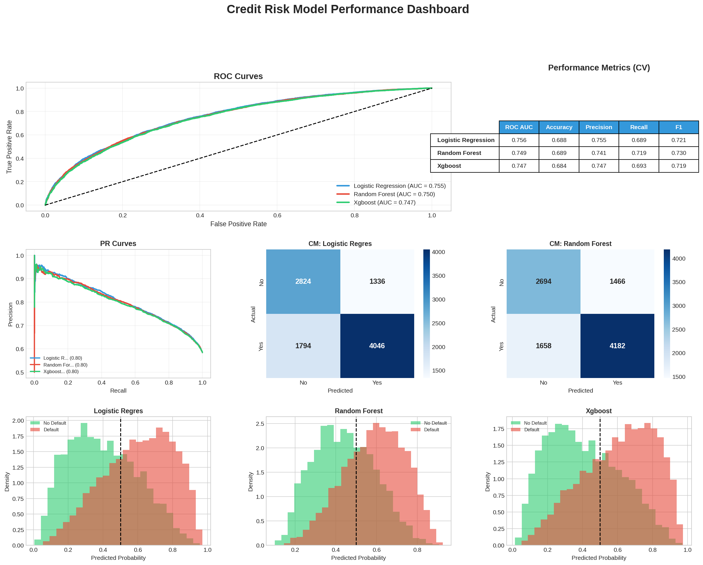

### Detailed Metrics (5-Fold CV)

| Model | ROC AUC | Accuracy | Precision | Recall | F1 Score |
|-------|---------|----------|-----------|--------|----------|
| **Logistic Regression** | 0.756 ± 0.007 | 0.688 ± 0.004 | 0.755 ± 0.004 | 0.689 ± 0.005 | 0.721 ± 0.003 |
| **Random Forest** | 0.749 ± 0.006 | 0.689 ± 0.005 | 0.741 ± 0.004 | 0.719 ± 0.006 | 0.730 ± 0.004 |
| **XGBoost** | 0.747 ± 0.005 | 0.684 ± 0.003 | 0.747 ± 0.003 | 0.693 ± 0.006 | 0.719 ± 0.003 |

### ROC Curve Comparison

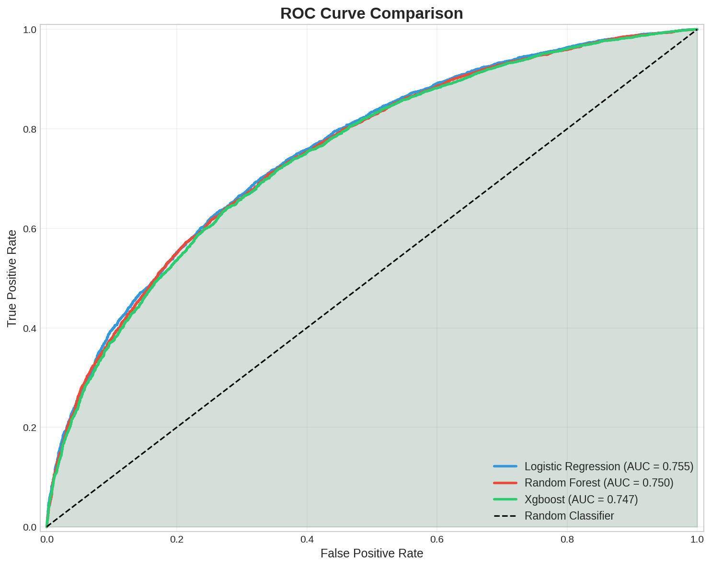

### Precision-Recall Curves

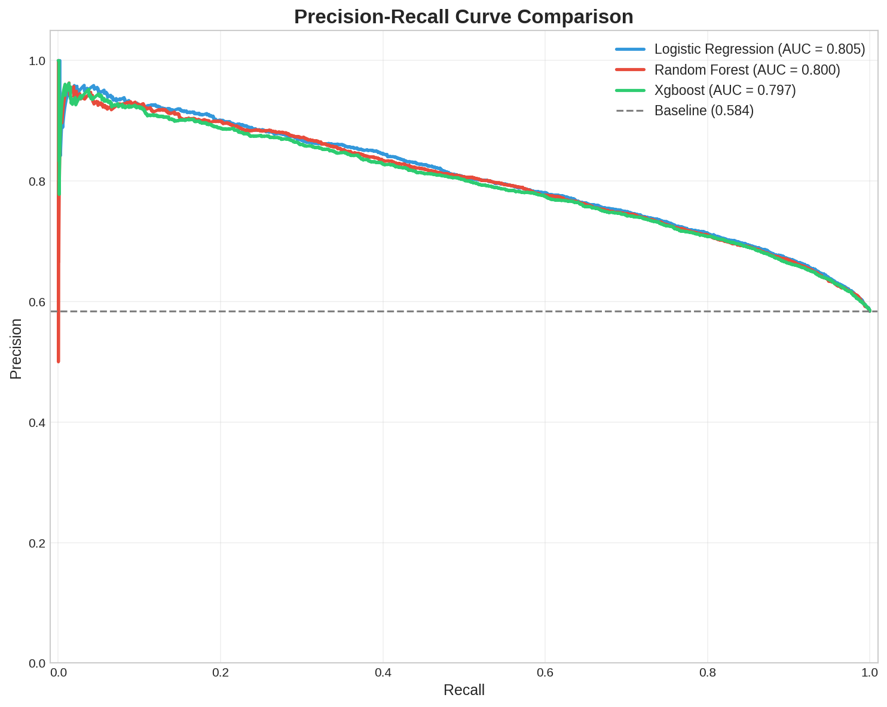

### Confusion Matrices

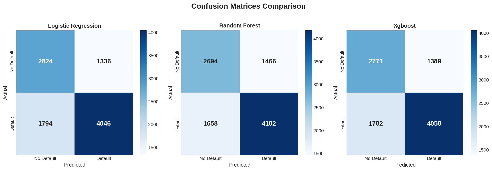

### Model Calibration

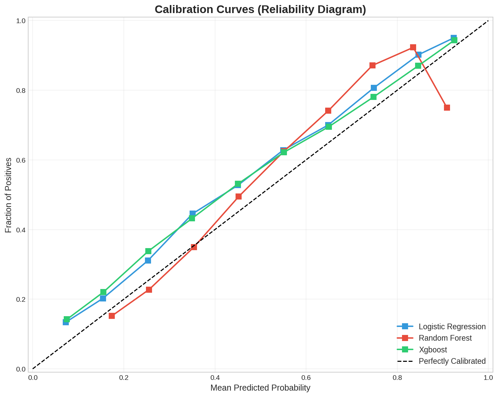

---

## 🎯 Model Interpretability

### SHAP Feature Importance

SHAP (SHapley Additive exPlanations) analysis provides insights into feature contributions:

#### XGBoost SHAP Summary

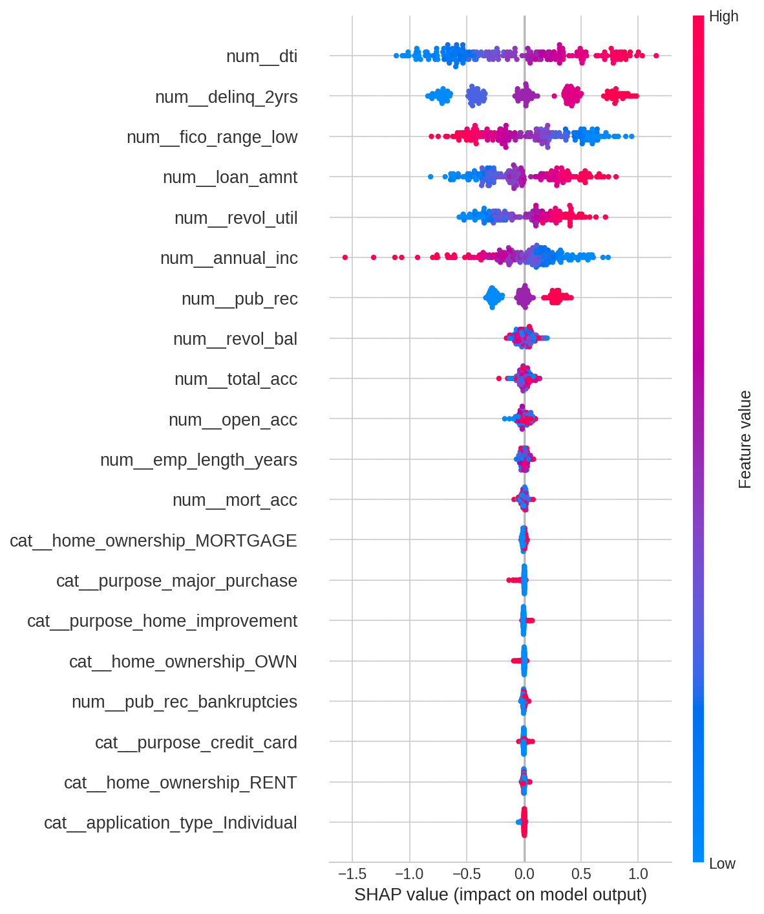

#### Feature Importance Rankings

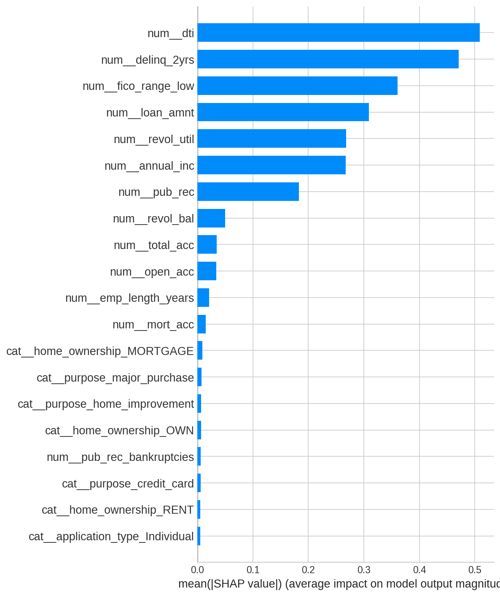

**Top Risk Factors:**
1. **FICO Score** — Lower scores significantly increase default probability
2. **DTI Ratio** — Higher debt burden = higher risk
3. **Delinquency History** — Past delinquencies are strong predictors
4. **Revolving Utilization** — High credit utilization indicates risk
5. **Loan Amount** — Larger loans carry higher default risk

---

## 📂 Project Structure

```
Credit-Risk-Default-Prediction-Modeling/
│
├── 📁 data/
│   ├── download.py              # Data acquisition & synthetic generation
│   ├── raw/                     # Raw data files
│   └── processed/               # Processed features
│
├── 📁 notebooks/
│   └── eda.ipynb                # Interactive EDA notebook
│
├── 📁 src/
│   ├── config.py                # Configuration & constants
│   ├── 📁 data/
│   │   ├── data_loader.py       # Data loading utilities
│   │   └── preprocess.py        # Preprocessing pipeline
│   ├── 📁 features/
│   │   └── feature_engineering.py  # Feature transformations
│   ├── 📁 models/
│   │   ├── train.py             # Model training with CV
│   │   ├── predict.py           # Prediction utilities
│   │   └── evaluate.py          # Evaluation metrics & plots
│   ├── 📁 explain/
│   │   └── shap_analysis.py     # SHAP explainability
│   ├── 📁 visualization/
│   │   ├── eda_plots.py         # EDA visualizations
│   │   └── model_plots.py       # Model performance plots
│   └── 📁 pipeline/
│       └── train_pipeline.py    # End-to-end pipeline
│
├── 📁 models/                   # Serialized model files (.joblib)
│
├── 📁 reports/
│   ├── metrics.json             # Performance metrics
│   ├── 📁 eda_plots/            # EDA visualizations
│   ├── 📁 model_plots/          # Model performance plots
│   └── 📁 shap_plots/           # SHAP analysis plots
│
├── requirements.txt             # Python dependencies
├── LICENSE                      # MIT License
└── README.md                    # This file
```

---

## 🚀 Installation & Usage

### Prerequisites
- Python 3.10+
- pip package manager

### Installation

```bash
# Clone the repository
git clone https://github.com/Raj-Purohith-Arjun/Credit-Risk-Default-Prediction-Modeling.git
cd Credit-Risk-Default-Prediction-Modeling

# Install dependencies
pip install -r requirements.txt
```

### Running the Pipeline

```bash
# Run the complete training pipeline
python src/pipeline/train_pipeline.py
```

This executes:
1. ✅ Data loading (downloads or generates synthetic data)
2. ✅ Preprocessing & feature engineering
3. ✅ EDA visualization generation
4. ✅ Model training with cross-validation
5. ✅ Model evaluation & visualization
6. ✅ SHAP analysis for interpretability

### Outputs Generated

| Directory | Contents |
|-----------|----------|
| `models/` | Trained model pipelines (`.joblib`) |
| `reports/metrics.json` | Cross-validation & test metrics |
| `reports/eda_plots/` | 6 EDA visualizations |
| `reports/model_plots/` | 7 model performance plots |
| `reports/shap_plots/` | SHAP plots for each model |

---

## 📌 Results & Conclusions

### Summary of Findings

1. **Best Overall Model**: **Logistic Regression** achieves the highest ROC AUC (0.756), making it ideal for ranking borrowers by risk.

2. **Best for Balanced Performance**: **Random Forest** achieves the best F1 score (0.730) with the best balance between precision and recall.

3. **Key Risk Indicators**:
   - FICO score is the most influential feature
   - Delinquency history strongly predicts future defaults
   - High DTI ratios indicate elevated risk
   - Loan-to-income ratio captures affordability risk

4. **Model Stability**: All models show low variance across CV folds (σ < 0.007 for ROC AUC), indicating robust generalization.

### Business Recommendations

| Risk Tier | FICO Range | Default Probability | Recommended Action |
|-----------|------------|--------------------|--------------------|
| Low Risk | 740+ | < 50% | Standard approval |
| Medium Risk | 670-739 | 50-60% | Enhanced verification |
| High Risk | < 670 | > 60% | Manual review required |

---

## 🔮 Future Improvements

- [ ] **Hyperparameter Optimization**: Implement Bayesian optimization for better model tuning
- [ ] **Ensemble Methods**: Create stacking/blending ensemble for improved performance
- [ ] **Feature Selection**: Apply recursive feature elimination to reduce dimensionality
- [ ] **Deep Learning**: Experiment with neural network architectures
- [ ] **Real-time Scoring API**: Deploy models as REST API endpoints
- [ ] **Fairness Analysis**: Evaluate model fairness across protected groups
- [ ] **Time-series Validation**: Implement temporal cross-validation for production scenarios

---

## 📜 License

This project is licensed under the MIT License - see the [LICENSE](LICENSE) file for details.

---

## 🤝 Contributing

Contributions are welcome! Please feel free to submit a Pull Request.

---

<p align="center">
  <b>Built with ❤️ for Credit Risk Analytics</b>
</p>
